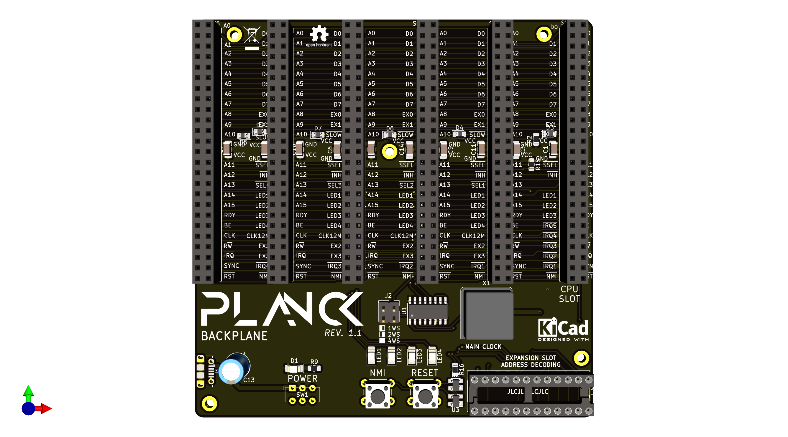

## Planck backplane
This is the backplane of the Planck 6502 computer.
A backplane is a mostly passive board where the daughter boards that actually provide functionality plug in to.

This backplane provides the power input (power is unregulated so you will need to provide a regulated power supply such as a usb adapter). A micro USB socket is provided for this purpose.

### Built in I/O

There is one power switch as well a two push buttons.
The first one triggers the reset pin via a MAX811 reset IC (which also provides power on reset)

The second push button triggers the NMI pin which triggers a "soft reset" of the computer.

In addition to the power LED, there are 4 LEDs that are connected to the expansion bus and can be turned on or off by expansion cards.

### Expansion cards 

There is built in address decoding logic for the expansion slots in the form of a GAL22V10 chip or equivalent. The decoding is very basic and simply sets a signal low that goes to one of the 5 expansion slots. Each expansion card is then responsible for trigerring itself when that signal is low. 

The address range available to each slot can be changed by simply reprogramming the GAL22V10 chip. By default the range `$FF80` to `$FFCF` is reserved for expansion cards. That is 16 bytes of address range for each of the 5 expansion slots

Expansion cards are not forced to honor their select line, it's just the range where they can be sure that the CPU board RAM or ROM will be disconnected from the data bus. We can therefore have a card like a RAM expansion board that can use banking to replace any address range, simply by asserting the INH signal when necessary.
Expansion cards must disconnect from the bus when another slot address range is called, or risk getting bus contention.

### CPU card slot

Slot 0 is special in that it is meant to host the CPU board, which also contains the base RAM and ROM. As such it has no select line, but a signal which indicates if any of the expansion board is selected, so that the rom and ram can be put offline.

A INH signal has also been added. This signal inhibits the built in ROM and RAM on the CPU board and let's the expansion board take over the bus (except for the range reserved for other expansion boards)

### Built-in clock

The onboard oscillator provides the base clock. It is divided by two to provide a stable clock to the peripherals that require it through the `CLK_12M` signal. Cards can assert the SLOW signal to require a slower clock. In that case the clock signal goes through a counter that divides the clock further. This is the `CLK` signal and is the only one that the CPU board listens to.

### Expansion bus signals

Most pins correspond to the pins of the same name on the CPU.

Below are the pins that are specific to the expansion bus:

| Pin number | Pin name | Description |
|-----   |-----|--------|
| 1 | A0 | Processor address bus pin 0 |
| 2 | D0 | Processor data bus pin 0 |
| 3 | A1 | Processor address bus pin 1 |
| 4 | D1 | Processor data bus pin 1 |
| 5 | A2 | Processor address bus pin 2 |
| 6 | D2 | Processor data bus pin 2 |
| 7 | A3 | Processor address bus pin 3 |
| 8 | D3 | Processor data bus pin 3 |
| 9 | A4 | Processor address bus pin 4 |
| 10 | D4 | Processor data bus pin 4 |
| 11 | A5 | Processor address bus pin 5 |
| 12 | D5 | Processor data bus pin 5 |
| 13 | A6 | Processor address bus pin 6 |
| 14 | D6 | Processor data bus pin 6 |
| 15 | A7 | Processor address bus pin 7 |
| 16 | D7 | Processor data bus pin 7 |
| 17 | A8 | Processor address bus pin 8 |
| 18 | EX0 | Extra pin for future use or for communication between expansion cards |
| 19 | A9 | Processor address bus pin 9 |
| 20 | EX1 | Extra pin for future use or for communication between expansion cards |
| 21 | A10 | Processor address bus pin 10 |
| 22 | SLOW | Used by slow peripherals to request a slower clock speed, active low. |
| 23 | GND | Ground |
| 24 | +5V | Positive voltage |
| 25 | +5V | Positive voltage |
| 26 | GND | Ground |
| 27 | A11 | Processor address bus pin 11 |
| 28 | SSEL | An expansion card is selected. Used by the processor card to disable it's built-in ram an ROM, active low |
| 29 | A12 | Processor address bus pin 12 |
| 30 | INH | When this is active (low), processor card RAM and ROM are disabled |
| 31 | A13 | Processor address bus pin 13 |
| 32 | SLOT_SEL | Used by the backplane to signal to expansion cards when they should activate, active low |
| 33 | A14 | Processor address bus pin 14 |
| 34 | LED1 | Connected to one of the backplane LEDs |
| 35 | A15 | Processor address bus pin 15 |
| 36 | LED2 | Connected to one of the backplane LEDs |
| 37 | RDY | Processor I/O pin. When low, the processor waits in it's curent state |
| 38 | LED3 | Connected to one of the backplane LEDs |
| 39 | BE | Processor input pin. when low the processor releases the bus |
| 40 | LED4 | Connected to one of the backplane LEDs |
| 41 | CLK | Main computer clock. Can be stretched or not depending on the state of the SLOW signal. |
| 42 | CLK_12M | Stable clock for e.g. VIA timers. **Not connected to slot 0** |
| 43 | RW | CPU read / write pin |
| 44 | EX4 | Extra signal 4. **Not connected to slot 0** |
| 45 | IRQ | This goes low when an interrupt request has occured, active low |
| 46 | EX5 | Extra signal 5. **Not connected to slot 0** |
| 47 | SYNC | CPU output. Indicates when the CPU is fetching an opcode |
| 48 | SLOT_IRQ | Used by expansion cards to signal an interrupt request to the processor board, active low  |
| 49 | RESET | Reset signal trigered by the button on the backplane, active low |
| 50 | NMI | non maskable interrupt signal trigered by the button on the backplane, active low |

### Board view

This is what the board looks like at the moment

 This documentation is licensed under a <a rel="license" href="http://creativecommons.org/licenses/by-sa/4.0/">Creative Commons Attribution-ShareAlike 4.0 International License</a>.