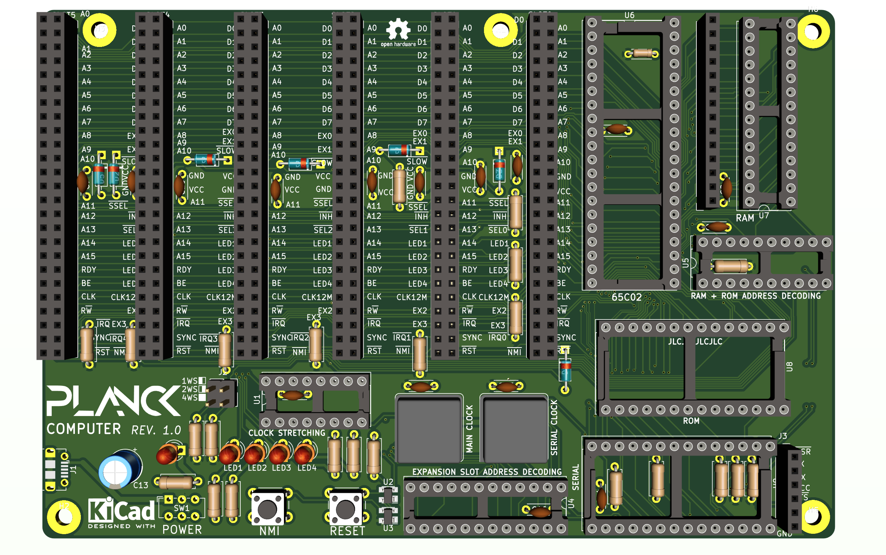

## Planck computer

This is a complete computer based on the Planck 6502 backplane.

It provides a 65c02 cPU, 32k of RAM, 32k of ROM and a serial port, as well as 6 expansion slots.

The board exceeds the original size specification of the original project (100 x 150mm instead of 100 x 100mm) but it seems that the cost will be similar (one more expensive board replaces 3 cheaper boards) as well as being more practical for some applications.

This computer can run absolutely stand alone when connected via the serial port. It can also accommodate 2 more expansion cards compared to the original backplane.

Here is a 3D view of the board:

 This documentation is licensed under a <a rel="license" href="http://creativecommons.org/licenses/by-sa/4.0/">Creative Commons Attribution-ShareAlike 4.0 International License</a>.