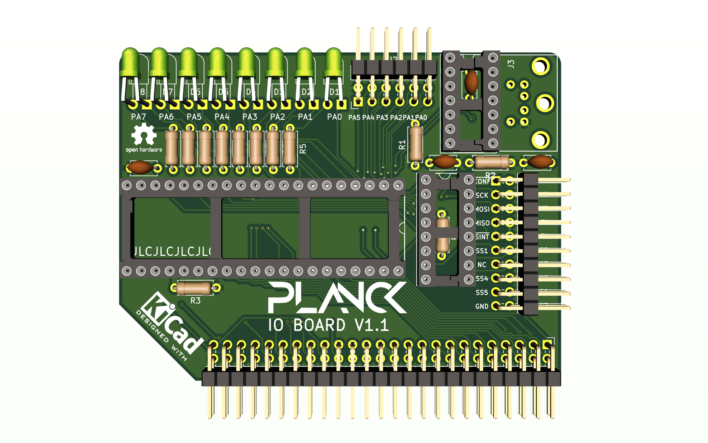

## Keyboard and IO board

This board is based on a 6522 chip.

### Features

- One PS/2 keyboard port
- One SPI port
- One parallel port

### Details

PORTA as well as CA1 and CA2 are brought out to a pin header on top of the board.

The PS/2 port uses CB2 for the clock and PORTB bit 7 as the data line.

There is also a modified [65SIB port](http://forum.6502.org/viewtopic.php?t=1064&start=105) on the back. The +12V have been replaced by +5V lines because there is not 12V on the board. Similary the -12V line is left unconnected.

This port allows 7 SPI devices to be connected to the IO board and uses PORTB pins PB0 to PB2 to select one of 7 devices (through a 74HC137)
PB3 is the SPI clock, PB4 is MISO, PB5 is MOSI, PB6 is the CONF signal and PB7 is used to latch the selected device into the 74HC137. The latching allows for pins PB0 to PB2 to do other things while an SPI device is being accessed at the cost of having to be careful not to make it interfere with the ps/2 keyboard.

This is what the board look like at the moment:

 This documentation is licensed under a <a rel="license" href="http://creativecommons.org/licenses/by-sa/4.0/">Creative Commons Attribution-ShareAlike 4.0 International License</a>.