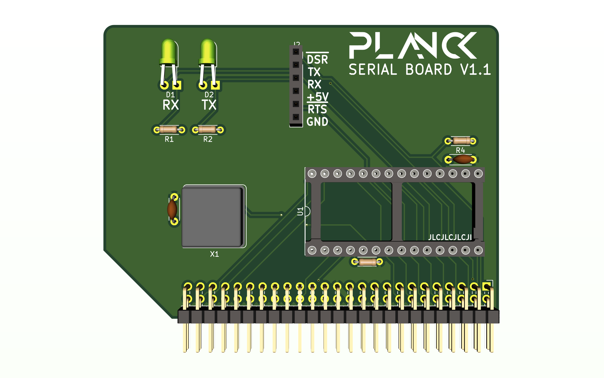

## Planck 6502 Serial board

This board uses a 6551 chip to provide a serial port for the computer. It accepts a TTL serial to usb adapter.

This is what the board looks like at the moment

 This documentation is licensed under a <a rel="license" href="http://creativecommons.org/licenses/by-sa/4.0/">Creative Commons Attribution-ShareAlike 4.0 International License</a>.