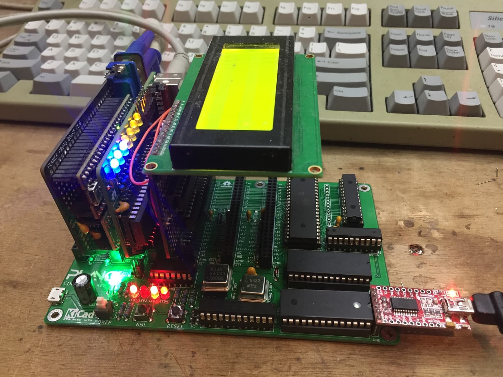
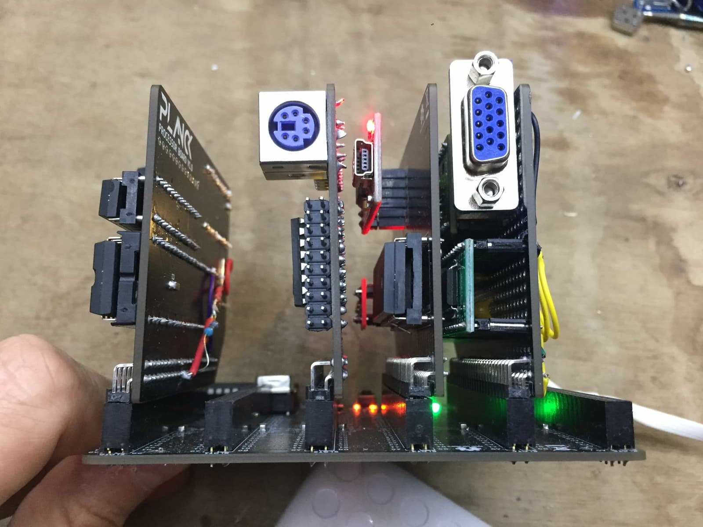
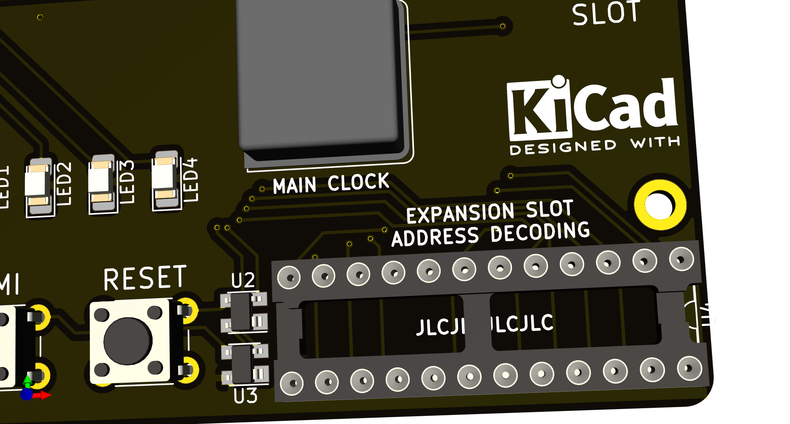
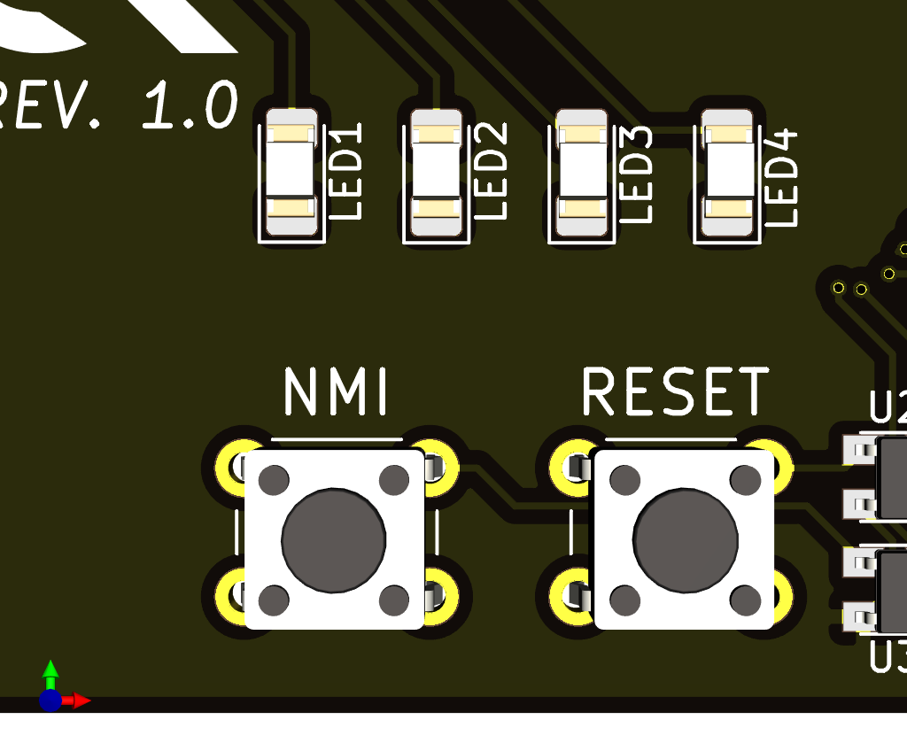
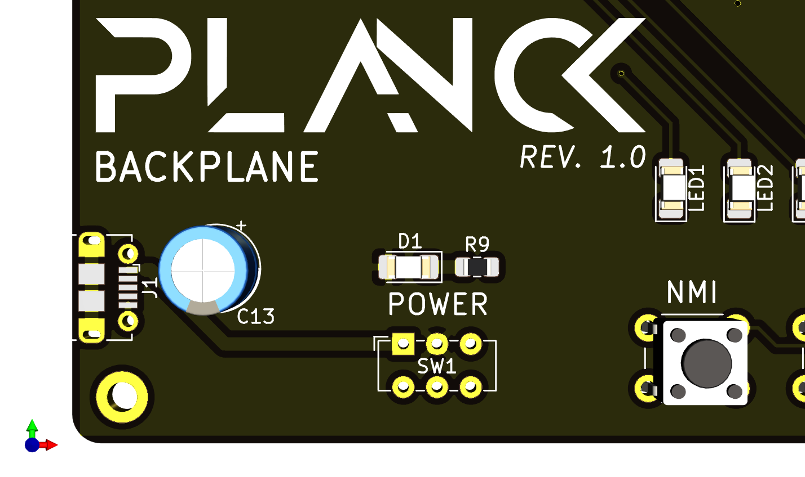

# Planck computer

# An open hardware, extensible 65c02 based computer

This is a hobby computer based on the 65C02 processor. (I use 6502 and 65C02 interchangeably in this document, but [there are some differences](http://wilsonminesco.com/NMOS-CMOSdif/))

There are already many computers based on the 6502 processor, old ones such as as the Apple 1, Apple II, Commodore 64 and many more; and many more recent ones, from homebrew affairs on prototype board, to complete replicas of old systems.

The one that most closely resembles the Planck is probably the RC6502, itself based on the RC2014 (which uses a Z80 processor) with adaptations to the expansion bus to make it fit the 6502 processor.

Planck is a new variant on this type of expandable machines with a different set of tradeoffs.

### Contraints and requirements

The constraints for it's design were the following:

  - Minimum board size, 2 layers, as that is what is cheapest to have fabricated.
  - Easily extensible with for example:
    - Serial port
    - Parallel port
    - SPI / SPI65B port
    - PS/2 port for keyboard
    - Sound card
    - VGA out
    - SD card
    - LCD screen
  - Target clock speed of 10 to 12 MHz

## Some details

These requirements resulted in a computer based on a [motherboard](/Hardware) hosting RAM, ROM and CPU and extension slots for expansion cards to plug into.

The [Planck hardware pages](/Hardware) explains more about the functionality of the motherboard and of each basic extension boards.

Of course, you can [design your own expansion boards](/Hardware/make) to make the computer do whatever **you** decide

### Expansion

Each expansion slot has a signal that should cause it to activate (SEL1 to SEL5 as detailed in the expansion bus description). The signals are generated by a programable logic chip on the motherboard (ATF22V10 or equivalent) according to the address that the processor is currently trying to access.

The main computer clock is generated on the motherboard by an oscillator. The clock signal goes through a binary counter, which makes it possible to slow down the clock when accessing slow devices.

The expansion slots are common 2x25 "Dupont" sockets on 2.54mm (100mil) centers and are very easy to obtain.

#### Expansion bus pinout

Most pins correspond to the pins of the same name on the CPU.

Below are the pins that are specific to the expansion bus:

| Pin number | Pin name | Description |
|-----   |-----|--------|
| 1 | A0 | Processor address bus pin 0 |
| 2 | D0 | Processor data bus pin 0 |
| 3 | A1 | Processor address bus pin 1 |
| 4 | D1 | Processor data bus pin 1 |
| 5 | A2 | Processor address bus pin 2 |
| 6 | D2 | Processor data bus pin 2 |
| 7 | A3 | Processor address bus pin 3 |
| 8 | D3 | Processor data bus pin 3 |
| 9 | A4 | Processor address bus pin 4 |
| 10 | D4 | Processor data bus pin 4 |
| 11 | A5 | Processor address bus pin 5 |
| 12 | D5 | Processor data bus pin 5 |
| 13 | A6 | Processor address bus pin 6 |
| 14 | D6 | Processor data bus pin 6 |
| 15 | A7 | Processor address bus pin 7 |
| 16 | D7 | Processor data bus pin 7 |
| 17 | A8 | Processor address bus pin 8 |
| 18 | EX0 | Extra pin for future use or for communication between expansion cards |
| 19 | A9 | Processor address bus pin 9 |
| 20 | EX1 | Extra pin for future use or for communication between expansion cards |
| 21 | A10 | Processor address bus pin 10 |
| 22 | SLOW | Used by slow peripherals to request a slower clock speed, active low. |
| 23 | GND | Ground |
| 24 | +5V | Positive voltage |
| 25 | +5V | Positive voltage |
| 26 | GND | Ground |
| 27 | A11 | Processor address bus pin 11 |
| 28 | SSEL | An expansion card is selected. Used by the processor card to disable it's built-in ram an ROM, active low |
| 29 | A12 | Processor address bus pin 12 |
| 30 | INH | When this is active (low), processor card RAM and ROM are disabled |
| 31 | A13 | Processor address bus pin 13 |
| 32 | SLOT_SEL | Used by the backplane to signal to expansion cards when they should activate, active low |
| 33 | A14 | Processor address bus pin 14 |
| 34 | LED1 | Connected to one of the backplane LEDs |
| 35 | A15 | Processor address bus pin 15 |
| 36 | LED2 | Connected to one of the backplane LEDs |
| 37 | RDY | Processor I/O pin. When low, the processor waits in it's curent state |
| 38 | LED3 | Connected to one of the backplane LEDs |
| 39 | BE | Processor input pin. when low the processor releases the bus |
| 40 | LED4 | Connected to one of the backplane LEDs |
| 41 | CLK | Main computer clock. Can be stretched or not depending on the state of the SLOW signal. |
| 42 | CLK_12M | Stable clock for e.g. VIA timers. **Not connected to slot 0** |
| 43 | RW | CPU read / write pin |
| 44 | EX4 | Extra signal 4. **Not connected to slot 0** |
| 45 | IRQ | This goes low when an interrupt request has occured, active low |
| 46 | EX5 | Extra signal 5. **Not connected to slot 0** |
| 47 | SYNC | CPU output. Indicates when the CPU is fetching an opcode |
| 48 | SLOT_IRQ | Used by expansion cards to signal an interrupt request to the processor board, active low  |
| 49 | RESET | Reset signal trigered by the button on the backplane, active low |
| 50 | NMI | non maskable interrupt signal trigered by the button on the backplane, active low |

The Planck 6502 computer is a single board computer that communicates over serial, or can be a standalone computer by adding expansion cards to one of the 6 slots present on the motherboard.

### Input / output
Also present on the backplane are two buttons and 4 LEDs.

One button triggers a reset of the processor, and the other triggers an non-maskable interrupt (NMI) which can be thought of as a "soft" reset.

The leds are connected to the expansion bus, and so any board can control them. They can be used as a crude debug tool, to show the status of some processing, to try out a simple blink routine or to signal an error to the user.

### Power delivery

The power to the board is provided by a micro USB plug at the bottom left. There is no regulator on the backplane so you must make sure that your power supply is regulated 5V. A USB power brick is perfect for this purpose.

A power switch and a power LED are also provided on the backplane.

## CPU board

The main board is [the CPU board](Hardware/proc_board) that provides it's own RAM and ROM (32K of each) and basic address decoding for these.

## I/O board

[The IO board](Hardware/io_board) is based on a WDC65C22 chip and provides a keyboard PS/2 port, a parallel port and a 65SIB port (serial port similar to and compatible with SPI)

## Serial board

[The serial board](Hardware/serial_board) is based on a WDC65C51 chip and provides serial output through a TTL serial to USB adapter. When plugging the USB cable to your PC, it may be best to unplug the power from the backplane and let the computer be powered from your PC through the USB to serial adapter.

 This documentation is licensed under a <a rel="license" href="http://creativecommons.org/licenses/by-sa/4.0/">Creative Commons Attribution-ShareAlike 4.0 International License</a>.

