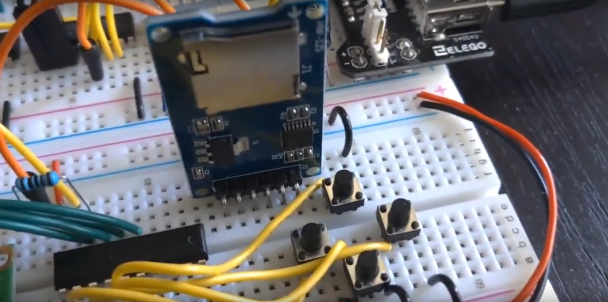

[Previous: Contents](../README.md)
---

# Prerequisites

It's assumed that you're starting with something like Ben Eater's 6502 setup,
which is basically the same as in Garth Wilson's tutorials,
and the hardware specifics here are tailored for that.  It should be easy to
adapt for other arrangements though - so long as you have a 6522 VIA.

You'll also need a socket to plug your SD card into.  I bought two of these
simple microSD adapters from a popular online marketplace:

   

There's not much logic on the board itself, just a 3.3V regulator and an IC to
level-shift between the SD card's 3.3V signals and your computer's 5V
TTL-compatible signals.

I've also used a microSD socket that's mounted on the back of an LCD "shield"
module designed for Arduinos - the details aren't critical and there are a lot
of options out there.

Some adapter boards (though not mine) provide a signal to tell you whether a
card is present, which you might find useful.

# References / Prior Work

I'm not the first to do this, of course!  6502s and SD cards have been around
for a long time and you're sure to find a lot of good examples if you search,
especially on places like hackaday.

Wikipedia has a good reference for basic SPI communication:
<https://en.wikipedia.org/wiki/Serial_Peripheral_Interface>

The following document was extremely useful regarding how SPI applies to SD
cards, how to send commands, the initialization sequence, and what all the
commands are: <http://elm-chan.org/docs/mmc/mmc_e.html>

You can also download the Physical Layer Simplified Specification from
<https://www.sdcard.org/downloads/pls/>.  I did, but didn't refer to it much.

As usual there are also many discussions on 6502.org.

---
[Next: About the Sample Code](0b_SampleCode.md)
